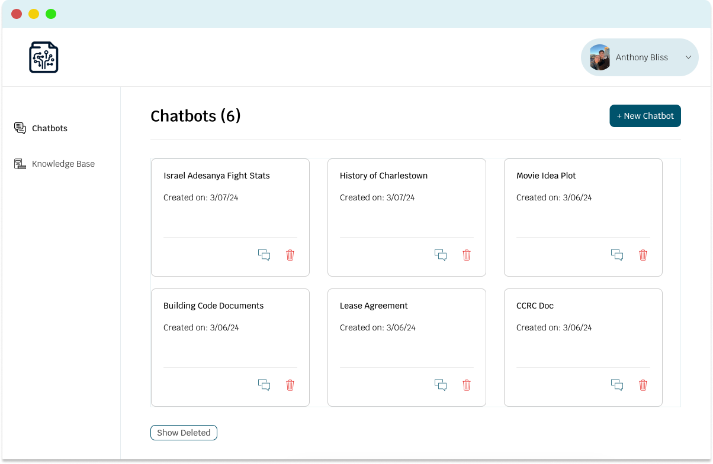
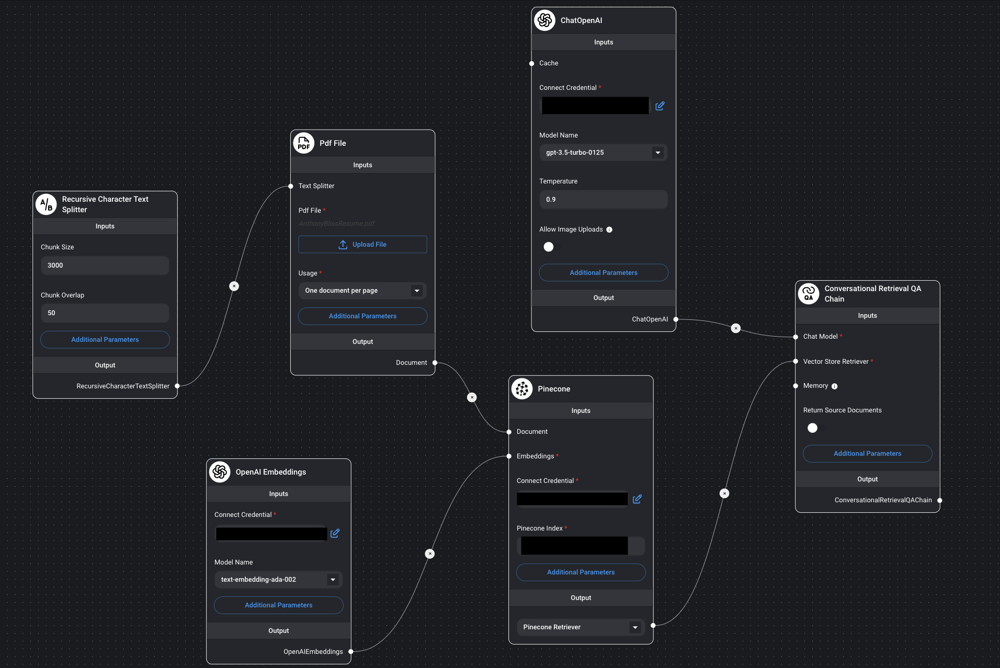
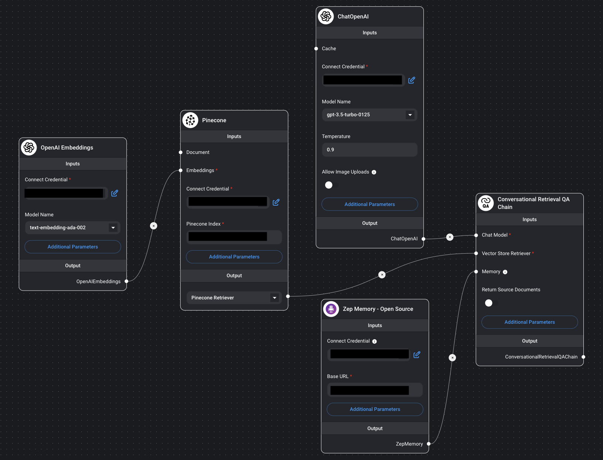

# Project Summary

## Background
The original intention behind this project was to build a simple tool that would summarize a user uploaded document. The goal for this project was to expand on recent experiences with OpenAI's API after using Assistants in my previous MMA Machine Learning project. I ended up completing the simple summarizer tool but decided to take it a step further and develop a few more skills along the way. This summary will mainly focus on the backend created for the [SmartDoc](https://mysmartdoc.com/) application.

## Architecture
First, Flowise was used to help create the backend API chatflows necessary for upserting and loading the user's submitted documents. Flowise was then hosted on Railway so there are consistent API end points for our application to point to. While building up the Flowise backend, there were two types of 'storage' used; Zep Memory and Pinecone. Zep is used to store the chat memory and is hosted on Render. Also, OpenAI's text embedding model was used to embed the user's documents before storing the vectors. Pinecone was used as the vector store and is crucial in the process of storing and retrieving the document vectors for the LLM through a Retrieval QA Chain. Finally, all components were brought together in a Bubble.io application. 

## Flowise
Flowise is really what brings this project together. The strategy was to have one API call that triggers when the user creates a chatbot and one that triggers when the user sends a message to the chatbot. The first call is to the 'Upsert' API endpoint where our flow upserts the user's document in the Pinecone index with the rest of our embedded vectors. The second call is to the 'Predict' API endpoint where our flow will use Pinecone and a Similarity Search on the relevant namespace then the GPT model will return an appropriate response to the user. One important thing to note is that we have multiple 'Document Upsert' flows depending on what type of document the user decides to use. Flows were made for CSV, DOCX, TXT, and PDF documents. The chatflows below are simple to make with Flowise and with enough time, can be configured to connect to a SQL Database. I look forward to using this tool more in the future.

  

## Pinecone
Pinecone is a great service/tool and allowed for this project to be ready for tests quickly. For the summary, the most important part of this process was the index setup. A few pod types were tested and I ultimately landed on the S1 Pod. I explained a lot of Pinecone's functionality in the previous section but one additional item is an API connection to our Pinecone index so we delete namespaces when they are no longer used. When the user deletes a chatbot, this triggers a call to delete the associated namespace from the Pinecone index. This will help manage the index efficiently. 

## Security
While it is always an important talking point, security is clear and straight forward with this project. To begin, Flowise is secure at the point of the chatflow. The flow requires authentication by API Key and then after that, only those with the key can call the API. This makes sure only authenticated requestes are handled by the API. Similarly, Pinecone uses authentication by API Key and also uses standard protocols to encrypt user traffic in transit. Bubble.io actually provides a slew of options to safeguard the application data. They provide options to enable 2FA for user accounts, securely confirm emails, and is SOC 2 and GDPR compliant. Bubble.io prides itself as "the most secure no-code platform". For chat memory, Zep was configured with JWT authentication (API Key) and an authentication secret was set in the server environment to ensure the server is not open to the public. Finally, by using OpenAI’s API the application ensures that the user's uploaded documents will not be stored to train future OpenAI models. Advancements in my security skill set were made from building this project but there is definitely more work to do in the future.

